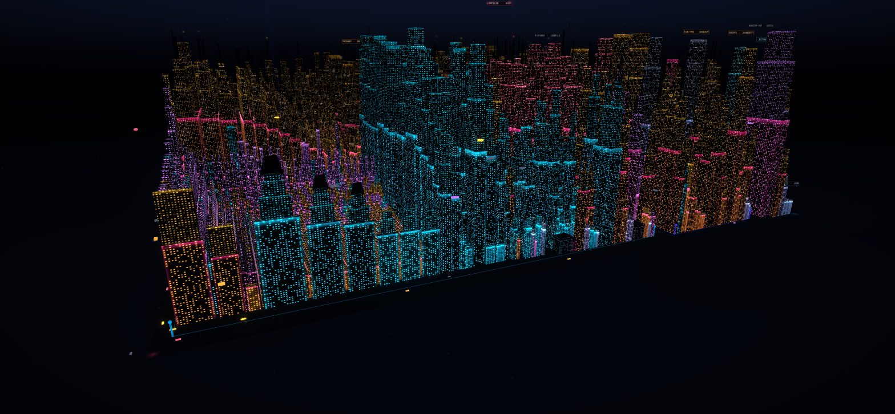
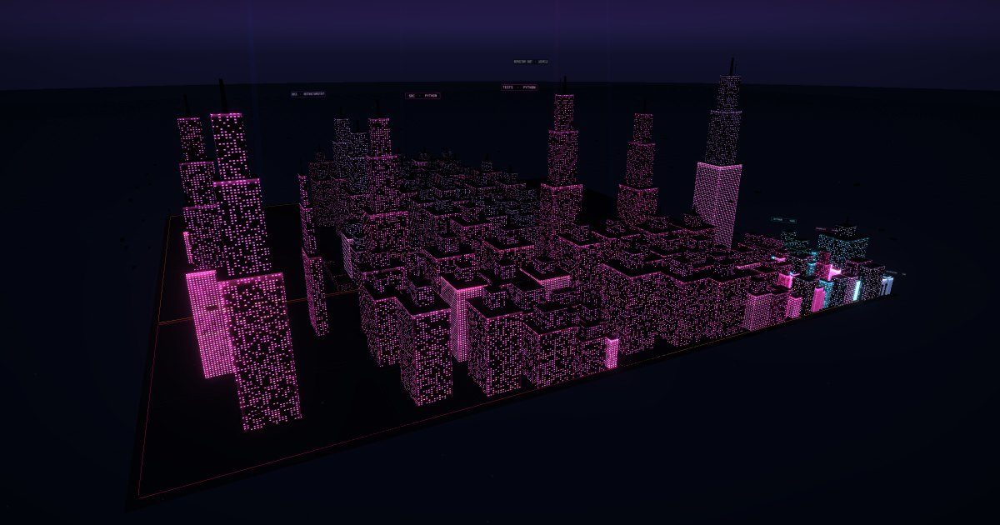

# RepoCity

[](https://github.com/HaithamAlMaamari/RepoCity/actions/workflows/quality.yml)
[](LICENSE)

**Explore any public GitHub repository as an interactive 3D city.** Files become buildings, directories become districts, and each language lights its own skyline.



## Features

- **Repo → city, deterministically.** The same repository at the same commit with the same seed always produces the same city — buildings, streets, traffic, stars, and all. Share the URL and everyone sees the identical scene.
- **Districts follow your directory tree.** A treemap layout carves the map into districts per top-level directory; building height tracks file size and facade colors track language.
- **A living city.** Street networks, ground and flying traffic, rooftop details, billboards, atmosphere, and particle effects — all procedurally generated from repository data.
- **Explore mode.** A keyboard-accessible file explorer synced to the 3D scene: select a building to inspect the file, or walk the tree to fly to its building.
- **Poster capture.** Export a 1920×1080 poster of any city for sharing.
- **Privacy-respecting backend.** A Cloudflare Worker proxies the GitHub API with strict validation, streamed response-size caps, rate limiting keyed by pseudonymous hashes, and no client-side tokens — ever.

## Gallery

Every city is generated purely from repository data, so a repository's language mix becomes its skyline's colour. Nothing here is hand-tuned per repo.

| | |
|---|---|
| **[facebook/react](https://github.com/facebook/react)** — JavaScript amber and Rust magenta, with the compiler's `build_hir.rs` as the tallest source file | **[vuejs/vue](https://github.com/vuejs/vue)** — almost entirely TypeScript, so the city reads cyan end to end |
|  |  |
| **[pallets/flask](https://github.com/pallets/flask)** — Python magenta, a small dense downtown with room to breathe | **Try your own** — type any `owner/repo`, then share the URL |
|  | The share URL pins the commit SHA and the presentation seed, so whoever opens it sees the identical city — same buildings, same traffic, same stars. |

## Quick Start

```sh
npm install
npm run worker:types
npm run dev
```

This builds the static assets, starts the Worker API on `http://127.0.0.1:8787`, and starts Vite on `http://127.0.0.1:5173` (Vite proxies `/api` to the local Worker). Open the Vite URL and enter any `owner/repo`.

**Requirements:** Node.js 22.13+ (22.x line), npm 10+, a WebGL2-capable browser.

The Worker works anonymously against GitHub for small repositories. For large-repository testing, copy `.dev.vars.example` to `.dev.vars` and set a fine-grained, public-contents-only GitHub token. The token is read only by the local Worker and must never appear in a `VITE_*` variable or any browser bundle.

## How It Works

```
Browser (Vite + Three.js)          Cloudflare Worker              GitHub API
┌─────────────────────────┐        ┌───────────────────┐        ┌───────────┐
│ src/data   validate +   │  /api  │ worker/  validate,│  REST  │ repos,    │
│            model repo   ├───────►│ traverse, sample, ├───────►│ trees,    │
│ src/city   treemap +    │        │ cache, rate-limit │        │ languages │
│            buildings    │        └───────────────────┘        └───────────┘
│ src/effects streets,    │
│            traffic, sky │        Deterministic per (repo, commit, seed)
│ src/explore file tree   │
└─────────────────────────┘
```

- Every GitHub response is treated as untrusted and runs through hand-written validators on **both** sides of the trust boundary (`worker/github.ts`, `src/data/github-contract.ts`).
- Successful results contain a proven-complete tree and declare whether files were sampled for rendering.
- Canonical share URLs pin the immutable commit SHA plus a presentation seed, so procedural effects reproduce exactly.

The architecture decision record lives in [`docs/architecture/ADR-001-github-data-service.md`](docs/architecture/ADR-001-github-data-service.md); the security analysis in [`docs/security/THREAT-MODEL.md`](docs/security/THREAT-MODEL.md).

## Project Structure

- `src/data` — GitHub ingestion, contract validation, and repository modeling
- `src/city` — treemap layout, districts, buildings, palettes, and architecture details
- `src/effects` — streets, ground and flying traffic, billboards, atmosphere, sky, and particles
- `src/explore` — the file-explorer model backing Explore mode
- `src/core` — camera, seeded randomness, and URL state
- `worker` — Cloudflare Worker: GitHub validation, traversal, sampling, caching, rate limiting
- `docs` — architecture decisions and the security threat model

## Quality Checks

```sh
npm run typecheck   # strict TS, app + worker targets
npm test            # unit tests + isolated Workerd runtime suite
npm run build       # typecheck + production build
npm run ci          # the full release gate CI runs
```

`npm run ci` reproduces the GitHub Actions gate: tests, both TypeScript targets, production build, high-severity dependency audit, and a Cloudflare deployment dry run. The Workerd suite validates real Worker bindings, request signals, streamed body limits, and Cache API behavior without production credentials or external network access.

## Security

- The browser only ever calls the same-origin RepoCity API; GitHub credentials remain Worker secrets.
- Private repositories are rejected even when the Worker credential could read them.
- Repository names, paths, API responses, and URL state are all treated as untrusted input.

See [`SECURITY.md`](SECURITY.md) for the reporting policy and [`docs/security/THREAT-MODEL.md`](docs/security/THREAT-MODEL.md) for the full analysis.

## Deployment

```sh
npm run deploy:check
npm run deploy
```

Production uses Cloudflare Workers Static Assets plus the same-origin ingestion Worker. Set the optional GitHub credential with `npx wrangler secret put GITHUB_TOKEN` — never in `wrangler.jsonc`. Complete traversal of very large repositories requires a Workers Paid plan; the Free plan's CPU and subrequest limits are not sufficient for the bounded fallback traversal.

## Contributing

Contributions are welcome — see [`CONTRIBUTING.md`](CONTRIBUTING.md) for setup, the release gate, and the two rules that matter most (determinism is a feature; GitHub is untrusted input). [`docs/ROADMAP.md`](docs/ROADMAP.md) is an honest, evidence-based list of what is still weak, ordered by impact, and each item says what "done" looks like.

## License

[MIT](LICENSE) © Haitham Al Maamari
